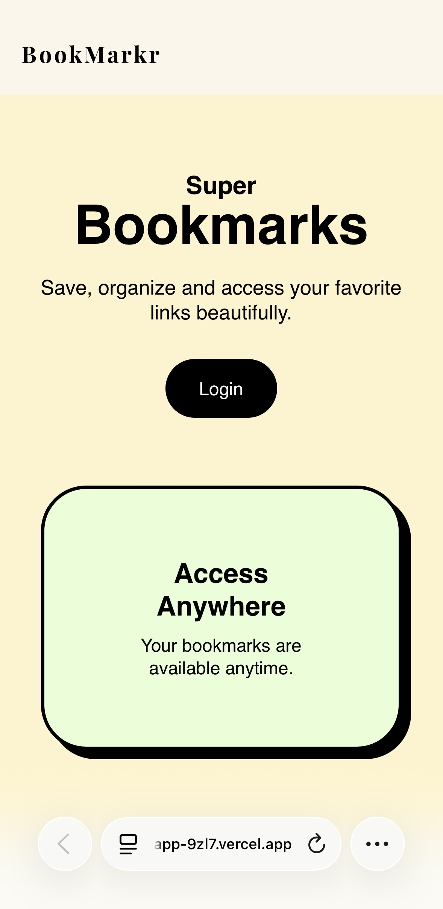
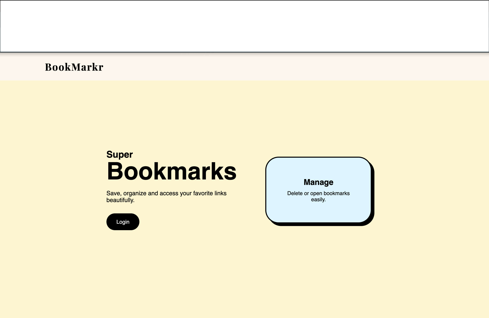
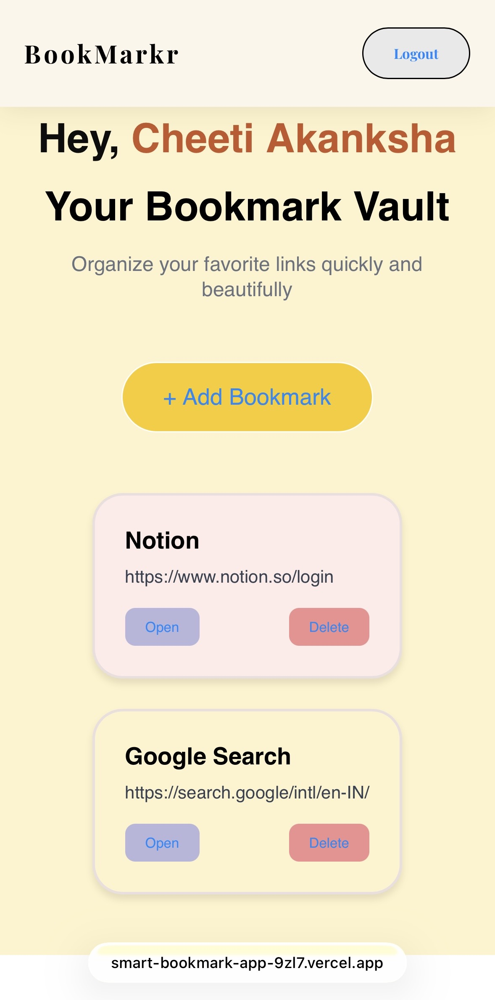
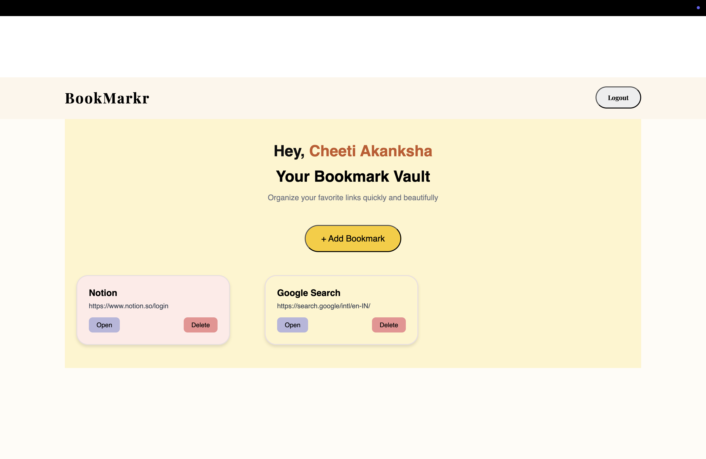

# Smart Bookmark App

A modern, minimalistic, and private bookmark manager that allows users to save, organize, and access their favorite links quickly. Built with **Next.js**, **Supabase**, and **Tailwind CSS**, this app supports **Google authentication**, **real-time updates**, and a **responsive design**.

---

## 🚀 Features

- Google authentication with Supabase OAuth
- Add, delete, and manage bookmarks
- Real-time updates with Supabase Realtime
- Responsive and mobile-first design
- Pastel-colored bookmark cards for better UI
- Personalized greeting with user name or email
- Easy navigation with a Navbar
- Toast notifications for actions

---

## 🖼️ Screenshots
### Landing Page - Mobile

### Landing Page - Desktop

### Dashboard - Mobile

### Dashboard - Desktop

---

## 🌐 Live Demo

You can try the app here: [https://smart-bookmark-app-9zl7.vercel.app/](https://smart-bookmark-app-9zl7.vercel.app/)

---

## 🛠️ Tech Stack

- **Frontend:** Next.js 16, TypeScript, React
- **Styling:** Tailwind CSS, Custom CSS
- **Backend / Database:** Supabase (PostgreSQL)
- **Authentication:** Supabase OAuth (Google)
- **Animations:** Framer Motion
- **Deployment:** Vercel

---

## Challenges & Solutions

While building the Smart Bookmark App, I faced several challenges:

1. **CSS not applying on dashboard page**  
   - **Problem:** Navbar styling worked, but dashboard components appeared unstyled.  
   - **Solution:** Moved page-specific CSS to an external file (`dashboard.css`) and imported it into `dashboard/page.tsx`.

2. **Supabase real-time updates not reflecting**  
   - **Problem:** Newly added bookmarks were not showing on the dashboard.  
   - **Solution:** Fixed the Google OAuth authentication flow and ensured the Realtime channel subscribed correctly to the current user's bookmarks.

3. **Duplicate bookmark entries**  
   - **Problem:** Clicking “Add” sometimes inserted the bookmark twice.  
   - **Solution:** Added a check in the Realtime subscription to prevent duplicate insertion.

4. **Responsive design issues**  
   - **Problem:** Cards were slightly misaligned on mobile and large screens.  
   - **Solution:** Used a centered grid layout with `justify-items: center` and proper max-width constraints. Added media queries for responsive columns.

5. **Button and card styling**  
   - **Problem:** Inline styles for buttons and cards did not provide consistent padding and spacing.  
   - **Solution:** Moved all styling to an external CSS file with a pastel color palette and proper spacing between elements.

6. **Centering header content after navbar**  
   - **Problem:** Greeting and page title were too close to the navbar.  
   - **Solution:** Added padding/margin to the header section to make “Hey, Name” and title visually balanced and centered.

